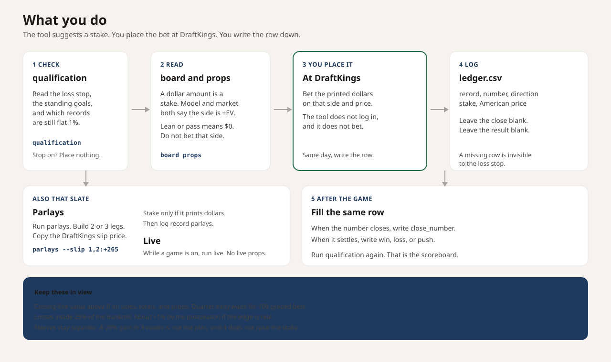
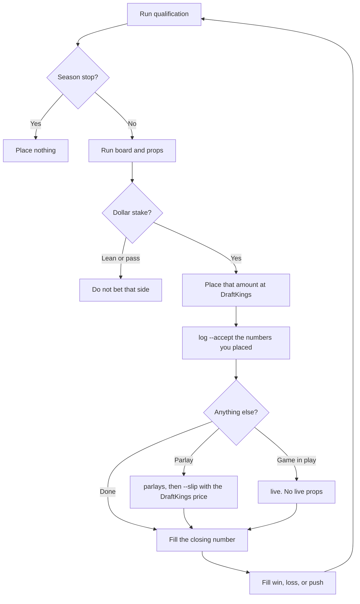

# NFL betting model

Decision support for bets you place yourself at DraftKings. A stake is a suggestion, not an order, and it is not a promise of profit.

The operating rule, locked 2026-09-26:

- Recommend a stake only when the statistical model and the sharp or consensus price are both +EV on the same side of the DraftKings line, after the vig is removed. If only one is +EV, it is shown as a lean and the stake is $0.
- Bankroll sleeves: **65%** pregame sides, totals, and moneylines, **20%** pregame props, **10%** live, **5%** parlays.
- Straight bets are a flat **1%** of that sleeve until the record qualifies, then quarter Kelly capped at **5%** of that sleeve. A record qualifies with at least 100 graded bets and an average closing-line value above 0. Sides (spreads and moneylines), totals, and props each qualify on their own record. Live stays flat.
- Parlays are same-game and cross-game, **2 or 3 legs only**. Stake flat **1%** of the parlay sleeve when the DraftKings parlay price is +EV against the fair joint probability and every leg that has a straight price passes the both-agree rule. Parlays do not upgrade to quarter Kelly.

Other straight-bet staking methods (`flat`, `units`, `full`, `half`, `quarter`) stay selectable with `--staking`. The edge threshold is a setting (`--min-edge`, default 2 percentage points), not a fixed cutoff.

## What you need

- Python 3.11+
- A free API key from [The Odds API](https://the-odds-api.com), which publishes DraftKings as a US book
- Your bankroll in dollars

This project does not log in to DraftKings, scrape it, or place a bet.

```bash
python3 -m venv .venv
source .venv/bin/activate
pip install -e ".[dev]"
export THE_ODDS_API_KEY=your_key_here
export NFL_BANKROLL=1000
```

Sign up at https://the-odds-api.com, open the dashboard, and copy the key. Do not commit it. The backtest and the qualification check run with no key. The first backtest downloads public nflverse schedules and weekly player stats and caches them in `.cache`.

## Commands

```bash
python -m nfl_model backtest
python -m nfl_model qualification
python -m nfl_model board --bankroll 1000
python -m nfl_model props --bankroll 1000
python -m nfl_model live --bankroll 1000
python -m nfl_model parlays --bankroll 1000
python -m nfl_model parlays --bankroll 1000 --slip 1,2:+265
python -m nfl_model log board --accept 1,3
python -m nfl_model log board --accept 1 --price 1:-108
```

The default print is the stake list for the current NFL week, through Tuesday noon Eastern. `--days 7` widens that window. `--verbose` adds the leans, the passes, and every priced side. `board`, `props`, `live`, and `parlays` exit with setup instructions when `THE_ODDS_API_KEY` is missing.

## What you do





Leave `close_number` and `result` blank until you know them. A row you never write is invisible to the loss stop.

`board`, `props`, `live`, and `parlays` number each suggested stake and save that list. Log before you run the same command again, because the next run replaces the list. Only the numbers you accept are written. A lean is not written.

```bash
python -m nfl_model log board --accept 1,3
python -m nfl_model log props --accept 2
python -m nfl_model log parlays --accept 1 --price 1:+265
```

`--price` is the American price on the DraftKings ticket when it moved. On a moneyline, an anytime touchdown, or a parlay, that price also sets the decimal bet number. On a spread, total, or yard prop, the line stays the number that was suggested. Logging the same open row again does not add a second row. This does not log into DraftKings.

## How to read a straight bet

A stake line shows the dollars, the side, the kickoff in Eastern time, and the DraftKings American price. Pass `--verbose` when you want the model probability, the edge, and the market probability on every side. The market price is Pinnacle with the vig removed when Pinnacle has the same number. Otherwise it is the average of the other books on that number. A different number is not treated as the same bet.

- **stake**: model and market are both +EV. The dollars are the suggestion.
- **lean**: only one signal is +EV, or the market price is missing. Stake $0.
- **pass**: neither signal clears `--min-edge` and `--min-ev`.

Edge is the model's win probability (ignoring pushes) minus the no-vig DraftKings probability. Expected value uses the actual DraftKings payout, including a push as a refund. Spreads and moneylines share the 65% sleeve. Totals use that same sleeve but keep a separate closing-line record.

## Parlays

`parlays` lists the straight legs that already both-agree, keeping the numbers you pass to `--slip`, then fair prices for 2- and 3-leg tickets built from those legs. `--verbose` lists the legs that did not agree.

- Cross-game: the joint probability is the product of the leg probabilities.
- Same-game spread, total, and moneyline: one normal margin and one normal total, with the correlation estimated from historical residuals. A moneyline and a spread on the same team are the same margin, so the joint is the stricter leg, not the product.
- Same-game props: a correlated draw. Passing yards, rushing yards, receiving yards, receptions, and anytime touchdowns use shrunk correlations with the game total and the player's team margin. Anytime touchdown is a rushing, receiving, return, or fumble score, not a passing touchdown.
- A ticket that mixes two games, with two legs from one of them, uses the same-game joint for that pair and multiplies the other game.

The Odds API does not publish DraftKings parlay or same-game parlay prices. Copy the price from the slip:

```bash
python -m nfl_model parlays --bankroll 1000 --slip 1,2:+265
python -m nfl_model parlays --bankroll 1000 --slip 4,5,9:-150
```

The numbers are the leg list printed by the command. If a selected leg did not both-agree, the ticket is a lean and the stake is $0. With a $1,000 bankroll the parlay sleeve is $50, so a qualified ticket is staked at $0.50. Live parlays are not priced. More than 3 legs are rejected.

## Closing-line value

Closing-line value is the closing number minus the bet number, in the direction of the bet. Positive means the close moved your way.

| Direction | Formula | Example |
| --- | --- | --- |
| over | close − bet | 49 − 47.5 = +1.5 |
| under | bet − close | 47.5 − 49 = −1.5 |
| spread | your point − close point | −3.5 − (−6.5) = +3 |
| decimal | your decimal odds − close decimal odds | used for moneylines |

Track graded bets in `ledger.csv` (see `ledger.example.csv`):

```csv
record,bet_number,close_number,direction,note,stake,american,result
sides,-3.5,-6.5,spread,home spread,0.65,-110,win
totals,47.5,49,over,game total,0.65,-110,loss
props,64.5,,over,receiving yards still open,0.20,-115,
```

`record` is `sides`, `totals`, `props`, `live`, or `parlays`. Live and parlays are shown but never upgrade. Until a straight record has 100 graded rows and a positive average, that record stays at flat 1%. Leave `close_number` blank until the game closes. `qualification` counts that row and tells you it does not count yet.

For each bet you actually place, also fill in `stake` (dollars), `american` (the DraftKings price, such as `-110` or `150`), and `result` once it settles (`win`, `loss`, or `push`). Leave `result` blank while the bet is open. A win's profit is the stake times the decimal odds minus the stake. A loss is minus the stake. A push is $0. Rows without those columns still grade closing-line value, and they are not included in the season profit.

## Standing goals

These are the goals the stake rule is built for. `qualification` prints them, and so does every stake list.

- **Skill.** Average closing-line value above 0, separately for sides, totals, and props. Quarter Kelly still waits for 100 graded bets and that positive average. Live and parlays stay flat.
- **Risk.** Once settled losses reach 25% of the bankroll, `board`, `props`, `live`, and `parlays` suggest no new stakes. On $100 the stop is $25. `NFL_LOSS_LIMIT_FRACTION` changes the share.
- **Season.** About +1% of the bankroll by the end of the postseason if a real edge of about 2 points is bet flat. On $100 that is about $1. On $1,000 that is about $10. Missing it is an ordinary result.
- **Ledger.** Write every bet you place: stake, American price, result, and the closing number. A row with no close does not count toward qualification. A row with no stake does not move the loss stop.
- **Sleeves.** Read profit by record. Sides are almost all of the dollars. Props, live, and parlays stay in their own sleeves.

Sides CLV averages spread points and moneyline decimals together. Props CLV averages yards, receptions, and touchdowns together. Read the sign and the count.

A 20% gain in 3 weeks is not one of these goals. At a $6.50 sides stake, that dollar target needs far more bets than the slate has. An optional window can still be printed, and it leaves the stake on the locked rule:

```bash
python -m nfl_model qualification --bankroll 1000 --goal-return 0.20 --goal-weeks 3 --goal-start 2026-09-27
```

The model does not raise stakes to chase a dollar profit. A cold run can lose more than the season's expected profit before the stop. Archive `ledger.csv` and start a new file when you want the next season's stop to begin at $0. The ledger has no placed-on date, so a window counts every row in the file.

## Environment

| Variable | Default | Role |
| --- | --- | --- |
| `THE_ODDS_API_KEY` | unset | Required for board, props, live, and parlays |
| `NFL_BANKROLL` | unset | Dollars. Required for those commands |
| `NFL_FAIR_PRICE` | `both` | `model`, `market`, or `both` |
| `NFL_STAKING` | `policy` | Locked rule, or `flat`, `units`, `full`, `half`, `quarter` |
| `NFL_FLAT_FRACTION` | `0.01` | Flat stake and the pre-qualification stake |
| `NFL_MAX_STAKE_FRACTION` | `0.05` | Cap, including quarter Kelly |
| `NFL_MIN_EDGE` | `0.02` | Edge threshold |
| `NFL_MIN_EV` | `0` | Minimum expected value |
| `NFL_BANKROLL_MODE` | `sleeves` | `sleeves` or `shared` |
| `NFL_SLEEVE_SIDES` | `0.65` | With the other sleeves, must sum to 1 |
| `NFL_SLEEVE_PROPS` | `0.20` | |
| `NFL_SLEEVE_LIVE` | `0.10` | |
| `NFL_SLEEVE_PARLAYS` | `0.05` | |
| `NFL_LOSS_LIMIT_FRACTION` | `0.25` | Stop new stakes after settled losses reach this share of the bankroll |
| `NFL_GOAL_RETURN` | unset | Profit goal as a fraction of the bankroll. 20% is `0.20` |
| `NFL_GOAL_WEEKS` | unset | Weeks allowed to reach `NFL_GOAL_RETURN` |
| `NFL_GOAL_START` | unset | First day of that window, `YYYY-MM-DD`. Set all three goal variables together |
| `NFL_UNIT_SIZE` | 1% of the sleeve | Used only with `--staking units` |

## Model

Team scores use each club's last 10 games of points scored and allowed, plus home field, fit by ridge regression. A week is predicted only from games already played. Margins and totals are normal, so whole-number lines can push and half-point lines cannot. DraftKings moneylines are treated as a push on a tie.

Player props shrink a recent average toward the position and scale it by the opponent's recent yards or scores allowed. Yards and receptions are normal. Anytime touchdown is Poisson.

Live lines start from that pregame forecast, then add the current score and the remaining fraction of the game. The fraction blends minutes since kickoff (about 190 minutes of wall clock) with the share of the pregame total already scored. It is not the official clock, and it does not know possession, down, or timeouts. The scores feed has no player box score, so live props are not recommended even if DraftKings posts them.

## Limits

- Outputs are decision support. They can lose money.
- Historical closes in the backtest are nflverse consensus lines, not DraftKings. Closing-line value is not measured there.
- The both-agree rule cannot be backtested on that file, because it has one price rather than a model price and a separate DraftKings price.
- Prop backtest is prediction error only. Historical prop prices are not in the open data.
- Parlay backtest is not available. DraftKings does not publish parlay prices through The Odds API.
- Same-game prop correlations are shrunk defaults plus the estimated margin/total correlation. They are not a play-by-play same-game model.
- Several bets on the same slate share one sleeve. If the suggestions add up to more than the sleeve, they are scaled down.
- Player names are matched by a normalized string. A mismatch is skipped.
- No parlays longer than 3 legs, no live parlays, no arbitrage, and no martingale.
- The season stop uses settled rows in `ledger.csv`. It cannot see a bet you placed and did not write down. Unsettled rows, and rows with no stake, are not losses yet.

## Tests

```bash
pytest
```
